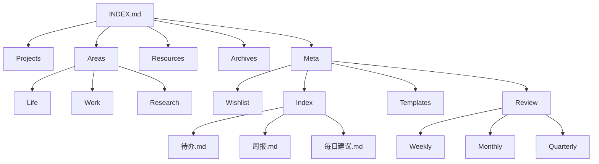

# AGENT 协作约定

本文件定义我与你协作维护此 Obsidian 子仓库的结构、书写规范与复盘机制。

## 目标

- 让笔记结构清晰、可检索、可复盘。
- 任务与研究进展可追踪。
- 我可以定期帮你总结、提醒与提出建议。
- 记录工作与生活的长期积累，形成周期复盘与下一步计划。

## PARA 规范

详见：[[Meta/Index/PARA-规范]]

## 顶层结构（PARA + Meta）

- `Projects/`：有明确目标与截止点的项目
- `Areas/`：需要长期维护的领域（Life/Work/Research）
- `Resources/`：参考资料与主题
- `Archives/`：已完成或不活跃内容
- `Meta/`：索引、模板、愿望清单（Wishlist）与复盘（Review）

辅助文件：
- `INDEX.md`：入口导航
- `AGENT.md`：协作约定

索引文件（Meta 下）：
- `Meta/Index/待办.md`：任务聚合
- `Meta/Index/周报.md`：周期复盘入口
- `Meta/Index/每日建议.md`：每日建议入口
- `Meta/Index/长期计划.md`：长期方向与里程碑
- `Meta/Review/INDEX.md`：复盘目录入口

## 结构图



## 命名与链接

- 以清晰中文命名为主。
- 统一用 wikilink：`[[文件名]]`。
- 需要高可复用的内容，优先拆成独立笔记并链接。
- 进展记录需要包含时间（至少日期），写在 frontmatter 的 `date` 或正文小节标题中。

## 标签（可选）

- `#task` 任务
- `#project` 项目
- `#research` 研究
- `#life` 生活
- `#wish` 愿望
- `#work` 工作

## 任务管理（基础）

- 任务用 Obsidian 任务语法：`- [ ]`。
- 不强制单独目录，任务可分散在对应主题笔记中。
- `Meta/Index/待办.md` 聚合任务（由我维护）。

## 模板（简洁版）

放置于 `Meta/Templates/通用笔记.md`：

```markdown
---
title: 
date: 
tags: []
status: 
---

# 标题

## 摘要

## 内容

## 行动项
- [ ] 
```

## 协作流程

- 日常：你写/口述，我整理到对应类别，并维护链接。
- 每日建议（早上）：我给出今日优先级建议与提醒。
- 每日建议输出：写入 `Meta/Index/每日建议.md`。
- 每周复盘：我汇总本周新增与变更，输出到 `Meta/Index/周报.md`，并给出 3-5 条建议或提醒。
- 待办清理：复盘时检查待办的完成/过期/拆分。
- 进展同步：你随时告诉我某项目进展，我更新对应项目的进度文档。
- 长期计划：有新的长期目标时，更新到 `Meta/Index/长期计划.md`。

## 后续可扩展

- 若你需要自动化复盘/提醒，告诉我具体时间和频率，我会帮你设置自动任务。

## 工作知识库路由（新增）

- 工作相关知识统一以 `knowledge/` 为事实来源，不在 skill 内重复维护。
- 排查问题时优先走 `knowledge/index.md`，再进入 `knowledge/domains/*`。
- 只有在需要执行稳定脚本时再调用小 skill：
  - `incident-context`
  - `service-trace`
  - `infra-context`
- `search_logs.sh`、`trace_lookup.sh`、`db_checks.sh` 当前视为 parked/inactive，不走默认路径。
