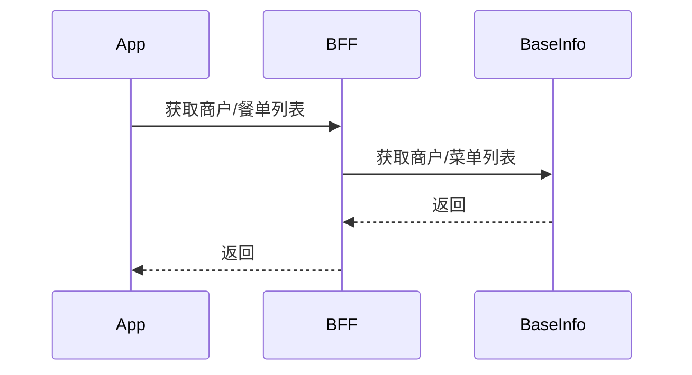
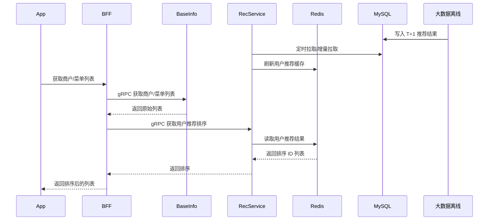
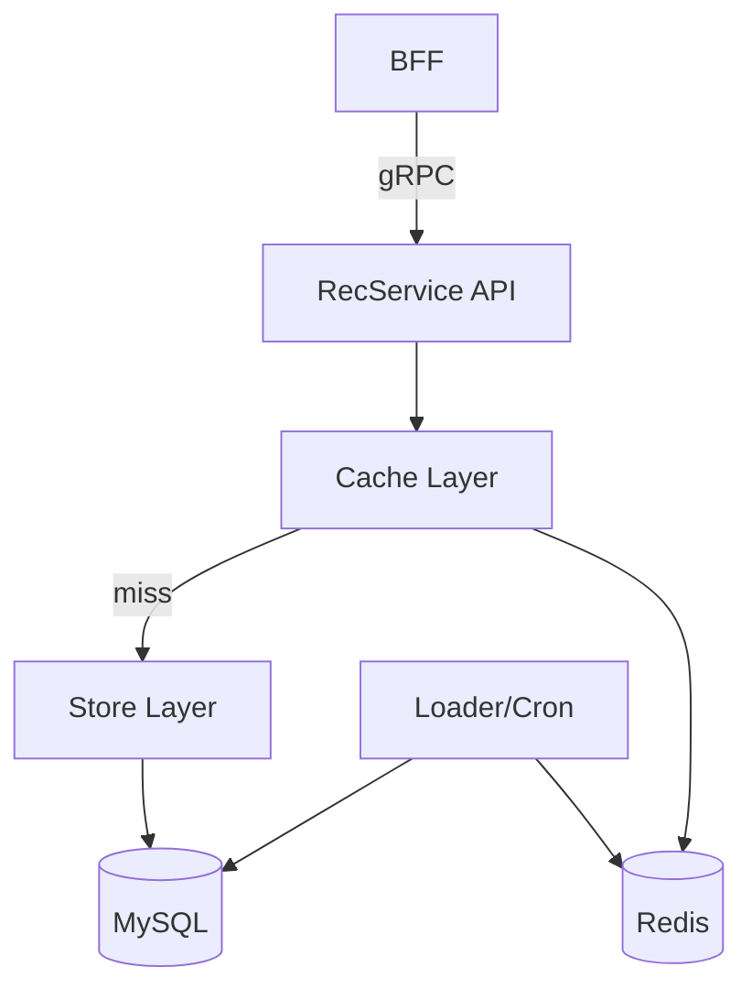
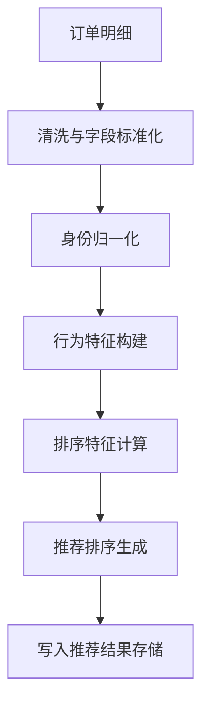

# Recommendation


---

场景是用户在一个点餐应用中，打开 App 可以看到可点餐的商户列表，点击进入一个商户列表，展示了餐品列表。

目前调用逻辑是



---
## 需求
大数据团队以及后端团队配合，根据推荐顺序进行展示，排序考虑：
- 用户点餐历史
- 一些策略
	- 比如是否是新上的，新店优先排序 N 天

实现上：
- 目前只考虑 T+1 天实效性，由大数据团队计算
- 使用 Go 写一个后端服务，提供排序信息

产出：
- 整体设计
- Go 服务架构等设计以及设计图（使用 mermaid）

---
## 前置条件
- 部署环境：Kubernetes
- 服务通信：gRPC
- 存储选择（如果需要数据库）
  - 结论：使用 PostgreSQL 作为持久化存储，Redis 作为缓存
  - 原因：推荐结果是结构化的用户-排序列表，PG 易于存储、版本化与运维；Redis 适合低延迟读取
  - ES 更适合全文检索/复杂检索场景，不是此类 KV 排序结果的最佳选择

---
## 整体设计
目标是把大数据离线计算出的排序结果在 BFF 层应用到商户/餐单列表的展示中，同时保证可用性、时效性和可回退。

核心原则：
- 离线计算 + 在线读取，T+1 数据即可
- BFF 只负责调用与组装，不做复杂排序逻辑
- 推荐服务可独立扩展、灰度与降级
- 推荐结果不可用时回退到原有 BaseInfo 顺序

---
## 方案总览
1) 大数据每日离线计算用户维度推荐排序结果
2) 推荐服务写入在线存储（Redis + MySQL 备份）
3) BFF 在获取商户/菜单列表后，调用推荐服务返回排序后的 ID 列表
4) BFF 以推荐顺序重排 BaseInfo 返回的列表
5) 推荐不可用/无数据时，回退原有顺序

---
## 数据流程


---
## 推荐服务（Go）设计
### 接口定义（示例）
请求：
```
GET /v1/recommendations?user_id=123&type=merchant&city_id=1
```

响应：
```
{
  "user_id": "123",
  "type": "merchant",
  "updated_at": "2025-01-01T00:00:00Z",
  "items": ["m1", "m2", "m3", "m4"]
}
```

说明：
- `type` 支持 `merchant` / `menu` / `dish` 等扩展
- `items` 仅返回排序 ID 列表，避免推荐服务和 BaseInfo 绑定

### 服务模块划分
- API：对外提供推荐排序读取接口
- Cache：Redis 读写，按 user_id + type 聚合
- Store：MySQL 读写，持久化离线结果
- Loader：定时/增量加载离线结果
- Metrics：命中率、延迟、回退率、数据新鲜度



---
## BFF 侧改造
1) 调用 BaseInfo 获取商户/菜单列表
2) 调用推荐服务获取排序 ID 列表
3) 根据 ID 顺序重排，未命中的 ID 追加到末尾
4) 推荐服务失败或超时，直接返回 BaseInfo 顺序

伪代码：
```
list = BaseInfoList()
rec = RecServiceList(userId, type)
if rec.ok:
    list = Reorder(list, rec.items)
return list
```

---
## 数据刷新策略
- 每日 T+1 全量离线结果落 MySQL
- RecService 每小时增量拉取并刷新 Redis
- Redis TTL 可设置 48h，保证服务短期可用

---
## 存储设计（PG + Redis）
### PostgreSQL（持久化）
表：`user_recommendations`
- `user_id` VARCHAR
- `rec_type` VARCHAR
- `items` JSONB
- `updated_at` TIMESTAMP
- `version` BIGINT

索引：
- `(user_id, rec_type)` 唯一索引
- `updated_at` 索引用于增量拉取

说明：
- `items` 存储排序 ID 列表
- `version` 用于离线结果版本化或幂等写入

### Redis（缓存）
Key：`rec:{type}:{user_id}`
Value：JSON（`items` + `updated_at` + `version`）
TTL：48h

---
## 可用性与回退
- 推荐服务不可用：BFF 直接回退原顺序
- 推荐结果为空：不影响主链路
- Redis 失效：回落 MySQL
- 数据过期：记录并报警，但不阻断主业务

---
## 指标与监控
- 推荐服务 QPS / 延迟 / 错误率
- Redis 命中率
- 回退率（推荐不可用）
- 数据新鲜度（距 updated_at 的时间差）

---
## 交付物
- 设计文档：包含数据流与模块设计
- 接口文档：请求/响应字段与错误码
- Go 服务架构与核心流程图（已给出）

---
## BI 技术方案（从表层到深入）
目标：在推荐离线计算中正确合并 `user_id` 与 `client_member_id` 的用户行为，保证排序结果稳定、可追溯、可回放。

### 1) 表层数据理解（业务规则）
- 用户下单可能使用 `user_id`、`client_member_id` 或同时出现
- 推荐的排序应覆盖“同一真实用户”的全部历史
- 需要保留“身份来源”用于分析与回溯（避免强行合并导致不可解释）

### 2) 身份合并策略（Identity Graph）
建立用户身份映射表，形成 `customer_key`（推荐系统的统一用户键）：
- 若订单同时含 `user_id` 与 `client_member_id`：建立强关联
- 若仅单一身份出现：先作为独立节点
- 当后续订单出现双身份时，将历史节点合并到同一 `customer_key`

合并原则：
- 以确定性规则优先（同一次订单或同一支付/设备绑定）
- 合并动作可追溯（记录合并原因与时间）
- 禁止“弱关联推断”直接合并（避免误合并）

### 3) 数据计算流程（离线）


### 4) 计算口径（关键中间表）
1) `order_fact`（事实表）
- 统一字段：`order_id`, `user_id`, `client_member_id`, `merchant_id`, `order_time`, `amount`, `city_id`

2) `identity_map`（身份映射）
- 字段：`customer_key`, `user_id`, `client_member_id`, `link_type`, `linked_at`
- `link_type`：`order_join` / `manual_fix` / `system_import`

3) `customer_behavior`（行为聚合）
- 以 `customer_key` 为粒度
- 特征：近 7/30/90 天下单次数、偏好品类、新店互动等

4) `recommendation_rank`
- 字段：`customer_key`, `rec_type`, `items`, `updated_at`, `version`

### 5) 存储设计（BI 层）
建议分层：
- ODS：原始订单明细（保留原始双身份字段）
- DWD：清洗后的订单事实表
- DIM：身份映射表（可修正）
- DWS：用户行为聚合
- ADS：推荐排序结果

### 6) 输出到推荐服务
- ADS 层每日 T+1 输出 `customer_key` 维度的排序结果
- RecService 写入 PG/Redis 时，使用 `customer_key` 作为主键
- BFF 侧按顺序优先取 `user_id` 绑定的 `customer_key`，若无则再尝试 `client_member_id`

### 7) 可追溯与修正机制
- 身份合并记录日志（可回放）
- 允许离线修复后回刷推荐结果
- 指标监控：合并率、单身份比例、推荐覆盖率、历史回补量

---
## 附录 A：身份映射构建示例 SQL
说明：以下为示意 SQL，具体语法可按数仓引擎调整（Hive/Spark/PG）。

1) 找到同单双身份强关联
```
WITH dual_id_orders AS (
  SELECT
    user_id,
    client_member_id,
    COUNT(*) AS cnt
  FROM order_fact
  WHERE user_id IS NOT NULL
    AND client_member_id IS NOT NULL
  GROUP BY user_id, client_member_id
),
new_links AS (
  SELECT
    CONCAT('c_', user_id) AS customer_key,
    user_id,
    client_member_id,
    'order_join' AS link_type,
    CURRENT_TIMESTAMP AS linked_at
  FROM dual_id_orders
  WHERE cnt > 0
)
INSERT INTO identity_map
SELECT * FROM new_links;
```

2) 单身份用户初始化为独立 customer_key
```
INSERT INTO identity_map
SELECT
  CONCAT('c_u_', user_id) AS customer_key,
  user_id,
  NULL AS client_member_id,
  'order_join' AS link_type,
  CURRENT_TIMESTAMP AS linked_at
FROM order_fact
WHERE user_id IS NOT NULL
GROUP BY user_id;

INSERT INTO identity_map
SELECT
  CONCAT('c_m_', client_member_id) AS customer_key,
  NULL AS user_id,
  client_member_id,
  'order_join' AS link_type,
  CURRENT_TIMESTAMP AS linked_at
FROM order_fact
WHERE client_member_id IS NOT NULL
GROUP BY client_member_id;
```

3) 后续出现双身份时合并（示意：保留旧 key 映射到新 key）
```
UPDATE identity_map
SET customer_key = CONCAT('c_', user_id)
WHERE client_member_id = :client_member_id
  AND customer_key LIKE 'c_m_%';
```

---
## 附录 B：BFF 侧 customer_key 选择逻辑
规则：优先 `user_id`，其次 `client_member_id`，最后回退为空。

伪代码：
```
func ResolveCustomerKey(userID, memberID string) string {
    if userID != "" {
        key := LookupCustomerKeyByUserID(userID)
        if key != "" { return key }
    }
    if memberID != "" {
        key := LookupCustomerKeyByMemberID(memberID)
        if key != "" { return key }
    }
    return ""
}
```

说明：
- 推荐服务可提供 `ResolveCustomerKey` gRPC 方法，减少 BFF 复杂度
- 若未命中 customer_key，则直接回退 BaseInfo 顺序

---
## 附录 C：BI 数据质量检查与告警
核心检查：
- 双身份订单占比异常（突增/突降）
- identity_map 合并率异常
- 推荐覆盖率下降（有行为但无推荐）
- order_fact 的 user_id 或 client_member_id 空值率异常
- 推荐结果更新延迟（T+1 未产出）

建议指标：
- `dual_id_order_ratio`
- `identity_merge_rate`
- `rec_coverage_rate`
- `id_null_rate_user`
- `id_null_rate_member`
- `rec_freshness_delay_hours`
