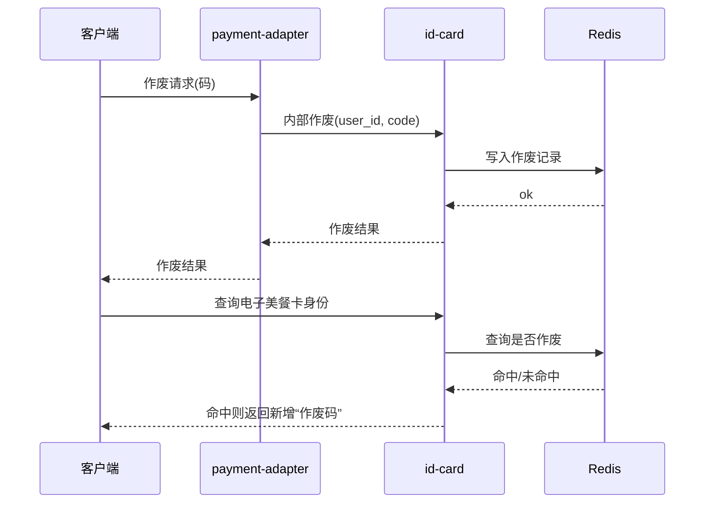

# 3.0 美餐码作废

## 摘要

昨日（2026-02-03）会议确认：到店/食堂所有都会调用「下单校验」接口，因此直接在 `id-card` 内实现美餐码作废，不在老系统（fan）中实现。

## 范围与职责

- 客户端在部分场景会请求美餐码作废，并上报码
- `payment-adapter` 提供对外 HTTP 作废接口，底层调用 `id-card`
- `id-card` 提供 internal 接口：参数为 `user_id` 与 `code`，作废美餐码并写入 Redis
- `id-card` 查询电子美餐卡身份时先查 Redis，若命中作废则返回新增的“作废码”
- `ops` 增加 `id-card` 新错误码处理与文案（文案与产品确认）

## 调用时序图

## 人员分工

- 研发：李健（2026-02-04 中午交接）
- 产品：梁伟

## 记录

- 2026-02-04：新增项目记录与范围说明。
