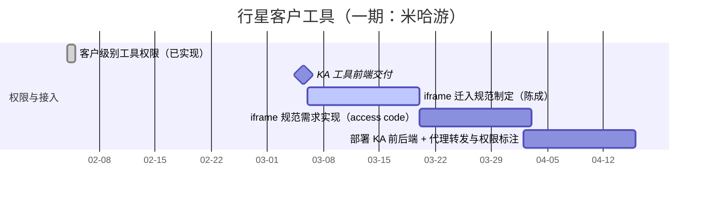

# meican-行星客户工具

## 摘要

该项目用于引入 KA 客户工具并完成行星侧接入。当前阶段先落地“客户级别工具权限”，作为整体方案第一步。
第一期目标客户为米哈游，后续将扩展到其他客户。

## 背景与范围

- 客户级别工具权限是当前阶段的核心交付
- KA 团队将在 2026-03 交付工具前端项目
- 陈成将评审代码并制定 iframe 迁入规范
- 我将根据规范实现 iframe 方案能力（可能涉及 access code，细节待定）
- 最终部署 KA 的前后端后，行星后端增加代理转发，并在接口上标注对应的客户权限

## 进展

- 2026-02-06：修复 JSON tag 读取问题。
- 2026-02-04：你已实现该功能。

## 实现线索

- 代码仓库：`/Users/zhanghang/go/src/go.planetmeican.com/planet/planet`
- 最新提交：`93151f4f`（feat: client tool）
- PR：[!237](https://gitlab.planetmeican.com/planet/planet/-/merge_requests/237)

## 实现细节

- 新增客户级别工具权限配置能力（per 客户维度）
- 行星后端支持后续工具接入的权限标注与扩展

## 行星实现细节与使用方式

### 实现细节

- 新增权限：`PERMISSION_TOOL_MIHOYO_MANAGEMENT`（米哈游工具管理），并可将“客户工具”绑定到任意权限上。
- `ListPermissions` 返回 `client_tools` 列表，单条包含 `name`、`client_id`、以及入口（`sftools_entry` 或 `iframe_url` 二选一）。
- 权限到客户工具的映射读取配置：基于 `client_tools<Permission>` 这一键（`Permission` 为枚举字符串），按权限逐个解析配置并生成工具列表。

### 配置格式（TOML）

配置为数组表，支持为任意权限追加客户工具；每个配置项可挂多个客户 ID。

```toml
[[client_tools.PERMISSION_TOOL_MIHOYO_MANAGEMENT]]
name = "xxx"
client_ids = ["123", "456"]
sftools_entry = "sftools:xxx"
iframe_url = "https://example.com/iframe"
```

说明：
- `client_ids` 为字符串数组（最终会转换为 `int64`）
- `sftools_entry` 与 `iframe_url` 二选一（按入口类型选择）
- 同一权限可配置多段 `[[...]]`，会被合并为多条 `client_tools` 输出

### 使用方式

1. 为目标权限追加对应的 `client_tools<Permission>` 配置（TOML）。
2. 通过 `ListPermissions` 获取 `client_tools` 列表（需要具备该权限）。
3. 前端依据 `client_tools` 渲染入口；后续 iframe 方案将基于规范与 access code 补齐鉴权细节。

## 里程碑与计划

1. 客户级别工具权限（当前阶段，我在做）
2. KA 在 2026-03 交付开发完成的工具前端项目
3. 陈成评审代码并制定 iframe 迁入规范
4. 我实现 iframe 规范相关需求（access code 等）
5. 完成 KA 前后端部署后，行星后端增加代理转发，并在接口上标注对应的客户权限

## 甘特图


