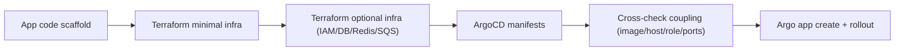

# App Bootstrap: Terraform + ArgoCD

## Scope
- This playbook explains what a new app usually needs in:
  - Terraform (infra provisioning)
  - ArgoCD repo (runtime deployment manifests)
- Evidence is based on real services:
  - `planet/app-constraint` (lean baseline)
  - `developer/dapi-be` (complex baseline)

## Environment/Folders Mapping
- `sandbox`:
  - ArgoCD: `/Users/zhanghang/go/src/go.planetmeican.com/meican-cd/argocd-sandbox`
  - Terraform: `/Users/zhanghang/go/src/go.planetmeican.com/meican-cd/terraform-sandbox`
- `production` (`meican1`):
  - ArgoCD: `/Users/zhanghang/go/src/go.planetmeican.com/meican-cd/argocd-production`
  - Terraform: `/Users/zhanghang/go/src/go.planetmeican.com/meican-cd/terraform-production`
- `prod` (`meican2`):
  - ArgoCD: `/Users/zhanghang/go/src/go.planetmeican.com/meican-cd/argocd-prod`
  - Terraform: `/Users/zhanghang/go/src/go.planetmeican.com/meican-cd/terraform-prod`

## What Is Mandatory vs Optional

### Terraform: minimal required
1. env/backend and provider versions:
   - `env.tf`
2. common context module:
   - `context.tf`
3. naming/tags locals:
   - `locals.tf`
4. image repository:
   - `ecr.tf`
5. route host records (if service exposed by kong/ingress host):
   - `route53.tf`

### Terraform: common optional additions
1. IAM role/policy for K8s service account:
   - `iam.tf`
2. DB/Cache resources:
   - `pg.tf`, `redis_non_cluster.tf`, etc.
3. alarm resources:
   - `pg_alarms.tf`, `redis_alarms.tf`
4. cross-system resources (SQS, etc.):
   - service-specific `sqs_*.tf`

### ArgoCD: minimal required
1. app registration CR:
   - `webapp.yaml`
2. workload deployment strategy:
   - `rollout.yaml`
3. services:
   - `service.yaml`
4. traffic split (canary):
   - `istio-virtual-service.yaml`
   - `istio-destination-rule.yaml`

### ArgoCD: common optional additions
1. ingress exposure:
   - `ingress-kong1.yaml`, `ingress-kong2.yaml`
2. autoscaling:
   - `hpa.yaml` / `cron-hpa.yaml`
3. observability/alerts:
   - `service-monitor.yaml`, `pagerduty.yaml`
4. service mesh egress controls:
   - `sidecar.yaml`, `serviceentry.yaml`
5. cloud access identity:
   - `service-account.yaml` (with IAM role annotation)
6. tiering/scheduling controls:
   - `tiered-application.yaml`

## Real Example A: `planet/app-constraint` (lean)

### Terraform (sandbox/prod)
- Paths:
  - `/Users/zhanghang/go/src/go.planetmeican.com/meican-cd/terraform-sandbox/planet/app-constraint/sandbox`
  - `/Users/zhanghang/go/src/go.planetmeican.com/meican-cd/terraform-prod/planet/app-constraint/production`
- Implemented infra is minimal and clean:
  - `context.tf` + `locals.tf`
  - `ecr.tf`
  - `route53.tf`
  - no IAM/DB/Redis in this app folder

### ArgoCD
- Paths:
  - `/Users/zhanghang/go/src/go.planetmeican.com/meican-cd/argocd-sandbox/planet/app-constraint`
  - `/Users/zhanghang/go/src/go.planetmeican.com/meican-cd/argocd-prod/planet/app-constraint`
- Runtime includes:
  - `webapp.yaml`, `rollout.yaml`, `service.yaml`
  - `istio-*`, `ingress-kong*`, `hpa.yaml`, `service-monitor.yaml`
  - plus `tiered-application.yaml`, `pagerduty.yaml`, mesh policies

## Real Example B: `developer/dapi-be` (complex)

### Terraform
- Paths:
  - `/Users/zhanghang/go/src/go.planetmeican.com/meican-cd/terraform-sandbox/developer/dapi-be/sandbox`
  - `/Users/zhanghang/go/src/go.planetmeican.com/meican-cd/terraform-prod/developer/dapi-be/production`
  - `/Users/zhanghang/go/src/go.planetmeican.com/meican-cd/terraform-production/developer/dapi-be/production`
- Beyond minimal set, this app adds:
  - `iam.tf` for `developer-dapi-be-sa`
  - prod DB/cache and alarms (`pg.tf`, `redis_non_cluster.tf`, `*_alarms.tf`)
  - meican1 branch keeps legacy/shared SQS ownership (`sqs_third-party-notification-service.tf`)

### ArgoCD
- Paths:
  - `/Users/zhanghang/go/src/go.planetmeican.com/meican-cd/argocd-sandbox/developer/dapi-be`
  - `/Users/zhanghang/go/src/go.planetmeican.com/meican-cd/argocd-prod/developer/dapi-be`
- Characteristics:
  - `webapp.yaml` with many MQ topics
  - both grpc and grpc-gateway/web exposure in ingress/service
  - `service-account.yaml` binds pod to IAM role from terraform

## Coupling Rules (Terraform <-> ArgoCD)
1. ECR repo name must match rollout image path.
2. Route53 host names should match ingress `spec.rules.host`.
3. IAM role name/ARN must match `service-account.yaml` annotation.
4. Exposed ports in `rollout.yaml` must align with `service.yaml` and ingress backend port names.
5. Environment/account-specific values must not be copied blindly:
   - ECR account id
   - kong host suffix (`eks-fan` vs `eks-fan2`)
   - terraform backend bucket/key

## Recommended Creation Sequence
1. Scaffold app code repo and runtime ports/config.
2. Create Terraform minimal set (`env/context/locals/ecr/route53`).
3. Add optional Terraform resources only when required (IAM/DB/Redis/SQS/alarms).
4. Create ArgoCD manifests (`webapp/rollout/service/istio`), then ingress/hpa/monitoring.
5. Validate coupling items (image, host, role, ports).
6. Register ArgoCD app and deploy by environment.

