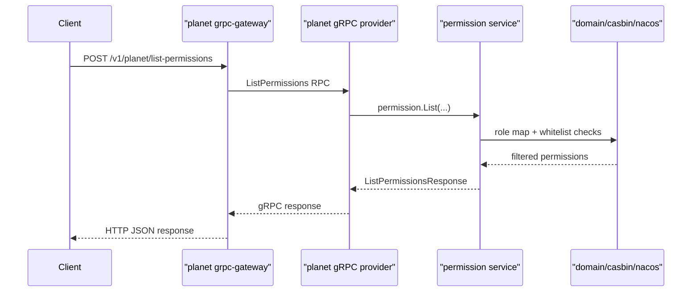
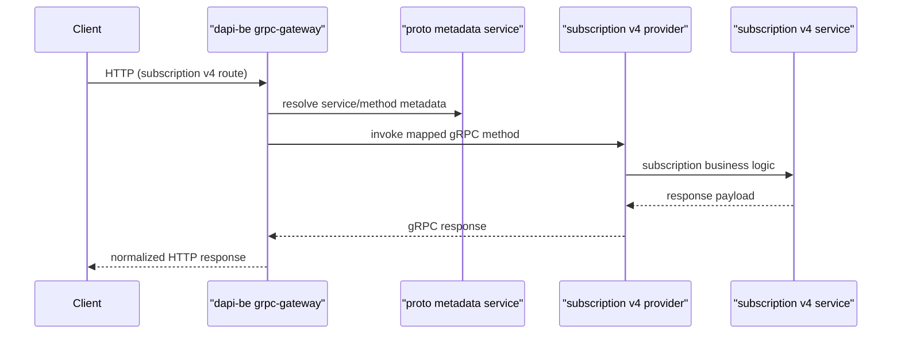

# Business Chains (Selected)

## Why this file
- Fix one recurring issue during debugging: "I know the service, but not the exact runtime chain."
- Provide concrete, reusable call chains with real code anchors.

## Chain A: `planet` permission query (grpc-gateway path)

### Entry
- HTTP RPC mapping in proto:
  - `/Users/zhanghang/go/src/go.planetmeican.com/planet/planet-proto/v1/planet_service.proto`
  - Method: `ListPermissions`
  - HTTP: `POST /v1/planet/list-permissions`

### Runtime path
1. gateway boot:
   - `/Users/zhanghang/go/src/go.planetmeican.com/planet/planet/cmd/main.go`
2. gateway handler registration:
   - `/Users/zhanghang/go/src/go.planetmeican.com/planet/planet/internal/net/grpcgateway/register.go`
3. gRPC service registration:
   - `/Users/zhanghang/go/src/go.planetmeican.com/planet/planet/internal/net/grpc/register.go`
4. provider entry:
   - `/Users/zhanghang/go/src/go.planetmeican.com/planet/planet/internal/net/grpc/providerv1/planet.go`
5. business orchestration:
   - `/Users/zhanghang/go/src/go.planetmeican.com/planet/planet/internal/service/permission.go`

### Chain sketch

## Chain B: `dapi-be` subscription v4 (dynamic proto metadata path)

### Entry
- HTTP RPC mapping in proto:
  - `/Users/zhanghang/go/src/go.planetmeican.com/developer/proto/subscription/v4/subscription_service.proto`
- Metadata options and method typing:
  - `/Users/zhanghang/go/src/go.planetmeican.com/developer/proto/option/v1/option.proto`

### Runtime path
1. gateway boot:
   - `/Users/zhanghang/go/src/go.planetmeican.com/developer/dapi-be/cmd/main.go`
2. dynamic proto metadata load:
   - `/Users/zhanghang/go/src/go.planetmeican.com/developer/dapi-be/internal/service/proto/proto.go`
3. gateway dynamic registration:
   - `/Users/zhanghang/go/src/go.planetmeican.com/developer/dapi-be/internal/net/grpcgateway/register.go`
4. gRPC registration:
   - `/Users/zhanghang/go/src/go.planetmeican.com/developer/dapi-be/internal/net/grpc/register.go`
5. provider and service:
   - `/Users/zhanghang/go/src/go.planetmeican.com/developer/dapi-be/internal/net/grpc/provider/subscription/v4.go`
   - `/Users/zhanghang/go/src/go.planetmeican.com/developer/dapi-be/internal/service/subscription/subscription_v4.go`

### Chain sketch

### Chain B debug checkpoints (high priority)
1. Sign verification:
   - validate sign-related headers, method sign meta, and timestamp skew.
2. Rate limit:
   - validate limit key extraction and env quota config (`sandbox`/`production`/`prod` may differ).
3. Authorization/policy:
   - verify auth middleware result before provider entry.
4. Metadata resolution:
   - ensure proto service/method metadata resolves to the expected runtime handler.
5. Then inspect business logic:
   - provider -> service -> domain.

## How to use in investigation
1. Pick chain by entry endpoint (HTTP path or RPC name).
2. Validate registration links first (gateway + grpc register).
3. Then inspect provider -> service -> domain.
4. Only after code path confirmation, move to logs/traces/db verification.
