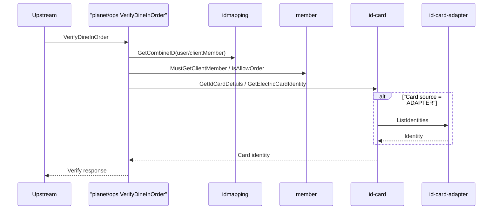

# Dependency Map

## Cross-service Calls (Seed)
- `dapi-be` -> `nation-client/client` (internal grpc calls in selected methods).
- `planet` -> internal permission/role dependencies.
- multiple services -> infra dependencies (redis/rds/pulsar/aws APIs).

## Scenario Chains
- Permission query chain (`planet`).
- Subscription and middleware chain (`dapi-be`).
- Dine-in order verify chain (`planet/ops`).

## Dine-in Verify Chain (`planet/ops`)

### Trigger
- gRPC `InternalService.VerifyDineInOrder` in `planet/ops`.
- Anchor: `/Users/zhanghang/go/src/go.planetmeican.com/planet/ops/internal/net/grpc/provider/internal.go:21`

### Call Sequence (Code Anchors)
1. `ops/internal provider` -> `service.DineIn.UnionVerify`
- `/Users/zhanghang/go/src/go.planetmeican.com/planet/ops/internal/net/grpc/provider/internal.go:27`
- `/Users/zhanghang/go/src/go.planetmeican.com/planet/ops/internal/service/dinein.go:57`
2. `UnionVerify` -> `PrepareIdentity` -> `idmapping.GetCombineID` / `member.MustGetClientMember`
- `/Users/zhanghang/go/src/go.planetmeican.com/planet/ops/internal/service/dinein.go:65`
- `/Users/zhanghang/go/src/go.planetmeican.com/planet/ops/internal/service/dinein.go:192`
- `/Users/zhanghang/go/src/go.planetmeican.com/planet/ops/internal/service/dinein.go:214`
3. Card path uses `id-card`:
- `GetIDCardDetails`: `/Users/zhanghang/go/src/go.planetmeican.com/planet/ops/internal/service/dinein.go:261`
- `GetElectricCardIdentity`: `/Users/zhanghang/go/src/go.planetmeican.com/planet/ops/internal/service/dinein.go:168`
4. Validate stage uses `member.IsAllowOrder`
- `/Users/zhanghang/go/src/go.planetmeican.com/planet/ops/internal/service/dinein.go:688`
5. `id-card` conditional downstream:
- Adapter card source -> `id-card-adapter.ListIdentities`
- `/Users/zhanghang/go/src/go.planetmeican.com/nation-client/id-card/internal/application/card/impl_card/adapter_card/adapter_card.go:67`

### Sequence Diagram

### Dependency Boundary
- `ops` owns verify orchestration and identity filtering.
- `member` owns order-permission decision.
- `idmapping` owns legacy/snowflake mapping.
- `id-card` owns card identity resolution.
- `id-card-adapter` only for adapter card-source mapping.

### Failure Hotspots
- `idmapping` no mapping / inconsistent legacy-snowflake inputs.
- `member.IsAllowOrder` returns deny and filters `client_member`.
- `id-card.GetIdCardDetails` returns invalid/expired/not-found.
- adapter card path returns multi-identities.

## Maintenance Rule
Each new chain entry must include:
1. trigger path
2. call sequence
3. dependency boundary
4. failure hotspots
