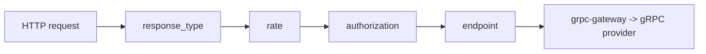

# dapi-be Gateway Failure Playbook

## Scope
- Repository: `/Users/zhanghang/go/src/go.planetmeican.com/developer/dapi-be`
- Focus: failures before business provider/service execution.

## Middleware Order (actual)
- registration:
  - `/Users/zhanghang/go/src/go.planetmeican.com/developer/dapi-be/internal/net/grpcgateway/server.go`
- order:
  1. response type
  2. rate limit
  3. authorization (sign verify)
  4. endpoint permission

## Symptom -> First Checks

1. `429` / `RateLimitExceeded`
- likely layer: `rate`
- code anchor:
  - `/Users/zhanghang/go/src/go.planetmeican.com/developer/dapi-be/internal/net/grpcgateway/middleware/rate/rate.go`
- check points:
  - path matched to method type? (`matchMethodType`)
  - developer identity extracted from headers?
  - limit key used:
    - `teamID_methodType` or fallback `developer_{id}`
  - qps source:
    - team custom qps or default qps
  - redis limiter config:
    - `redis.limiter.address`, `redis.limiter.db`

2. `401` + 签名相关报错（`AuthenticationFailed`）
- likely layer: `authorization`
- code anchor:
  - `/Users/zhanghang/go/src/go.planetmeican.com/developer/dapi-be/internal/net/grpcgateway/middleware/authorization/authorization.go`
  - `/Users/zhanghang/go/src/go.planetmeican.com/developer/dapi-be/internal/net/grpcgateway/middleware/authorization/v1.go`
  - `/Users/zhanghang/go/src/go.planetmeican.com/developer/dapi-be/internal/net/grpcgateway/middleware/authorization/v2.go`
- first split:
  - V1: header includes `DeveloperRn` + `Signature`
  - V2: header includes `Meican-Developer-Id` + `Sign`
- check points:
  - `Timestamp` timeout?
  - `Nonce` reused?
  - developer exists?
  - signed URL/body exactly matches request bytes?
  - sign version chosen as expected by route prefix and service meta

3. `403` + “接口权限未开通”
- likely layer: `endpoint`
- code anchor:
  - `/Users/zhanghang/go/src/go.planetmeican.com/developer/dapi-be/internal/net/grpcgateway/middleware/endpoint/endpoint.go`
- check points:
  - `MatchEndpoint(path)` result
  - path in ignore set?
  - target endpoint permission configured for developer/team?

4. `404` + “未找到匹配的接口”
- likely layer: `rate` pre-check method type mapping
- code anchor:
  - `/Users/zhanghang/go/src/go.planetmeican.com/developer/dapi-be/internal/net/grpcgateway/middleware/rate/rate.go`
- check points:
  - proto method has HTTP annotation?
  - method meta extracted correctly?
  - request path format matches registered pattern?

## Header Contract Quick View
- common:
  - `Timestamp`
  - `Nonce`
- V1:
  - `DeveloperRn`
  - `Signature`
- V2:
  - `Meican-Developer-Id`
  - `Sign`
- constants:
  - `/Users/zhanghang/go/src/go.planetmeican.com/developer/dapi-be/internal/model/http.go`

## Evidence Collection Order (ticket handling)
1. Fix environment and time window (`sandbox`/`production`/`prod`).
2. Capture request path + response code + response body.
3. Capture request headers used for sign/rate (redact sensitive values).
4. Confirm middleware layer by error code/message.
5. Only after gateway gates pass, move to provider/service/domain debugging.

## Practical Log Query Tips (with LogClick FE)
- for sign issues:
  - keyword: `authorization verify err`
  - keyword: `values.ValidateFormat err`
  - keyword: `developer not found`
- for rate issues:
  - keyword: `rate limit reached`
  - keyword: `rate limit err`
  - keyword: `no method type matched`
- for endpoint permission:
  - keyword: `endpoint not match`

Use `path` + `developer_id` + time range as primary filters.
