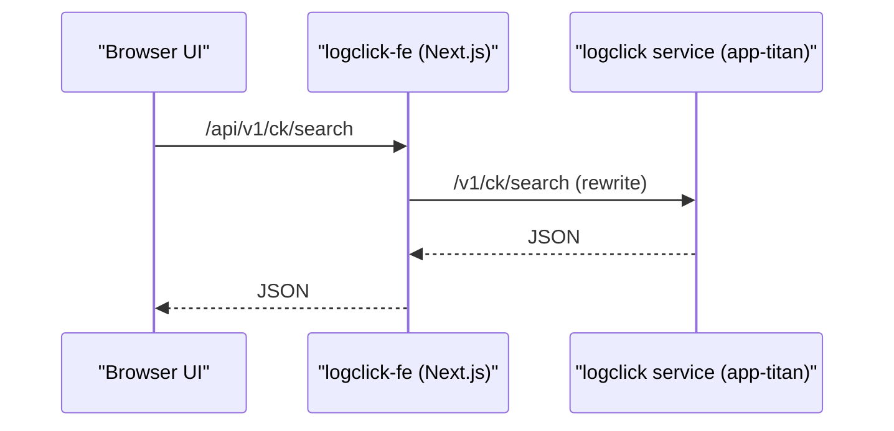

# LogClick FE API Playbook

## Scope
- Repository: `/Users/zhanghang/go/src/go.planetmeican.com/titan/web-apps/logclick-fe`
- Focus: API paths used by frontend for log query and common failure points.

## Request Path Model
- Frontend axios base URL:
  - `NEXT_PUBLIC_API_BASE_URL` (default `/api`)
  - file: `/Users/zhanghang/go/src/go.planetmeican.com/titan/web-apps/logclick-fe/src/lib/http.ts`
- Next.js rewrite:
  - `/api/:path*` -> `http://logclick.app-titan.svc.cluster.local:8024/:path*`
  - `/sso/:path*` and `/api/sso/:path*` -> `http://logclick.app-titan.svc.cluster.local/sso/:path*`
  - file: `/Users/zhanghang/go/src/go.planetmeican.com/titan/web-apps/logclick-fe/next.config.ts`

## ClickHouse Query APIs (Primary)
- API wrapper file:
  - `/Users/zhanghang/go/src/go.planetmeican.com/titan/web-apps/logclick-fe/src/services/logclick-api.ts`
- Service facade:
  - `/Users/zhanghang/go/src/go.planetmeican.com/titan/web-apps/logclick-fe/src/services/logclick.ts`

Endpoints:
1. `GET /v1/ck/apps`
2. `GET /v1/ck/fields?range.left=...&range.right=...`
3. `GET /v1/ck/apps/{app}/fields/{field}/values`
4. `POST /v1/ck/search`
5. `POST /v1/ck/stream-search` (defined in API wrapper, not primary in current page flow)

Search body shape (`LogclickSearchInput`):
- `sort`: timestamp or fieldV2 sort
- `aggregation`: typically `{ field: "timestamp" }`
- `query`:
  - `range.left`, `range.right` (absolute ISO in runtime request)
  - `filters`
  - `limit`

Current FE behavior:
- default search limit from system store: `3000`
- request timeout configurable in UI, bounded to `10s ~ 300s`
- files:
  - `/Users/zhanghang/go/src/go.planetmeican.com/titan/web-apps/logclick-fe/src/store/system-store.ts`
  - `/Users/zhanghang/go/src/go.planetmeican.com/titan/web-apps/logclick-fe/src/components/apply-timeout-bridge.tsx`

## S3 Query APIs
- API wrapper:
  - `/Users/zhanghang/go/src/go.planetmeican.com/titan/web-apps/logclick-fe/src/services/logs3-api.ts`
- Service facade:
  - `/Users/zhanghang/go/src/go.planetmeican.com/titan/web-apps/logclick-fe/src/services/logs3.ts`

Endpoints:
1. `GET /v1/s3/tree`
2. `POST /v2/s3/search` (main in current FE hook)

S3 search body highlights:
- `query.timeRange.left/right`
- `query.domain`, `query.namespace`, `query.name`
- `query.filters`
- `query.limit`

Current FE behavior:
- hook forces S3 query limit to `10000`
- search is gated by required selectors (`domain`, `namespace`, `name`, `date`)
- files:
  - `/Users/zhanghang/go/src/go.planetmeican.com/titan/web-apps/logclick-fe/src/hooks/queries/logs3.ts`
  - `/Users/zhanghang/go/src/go.planetmeican.com/titan/web-apps/logclick-fe/src/app/s3/logs/page.tsx`

## Auth and Session Path
- Page access middleware checks cookie (`session` or planet cookie):
  - `/Users/zhanghang/go/src/go.planetmeican.com/titan/web-apps/logclick-fe/src/proxy.ts`
- user identity endpoint:
  - `GET /api/me` parses cookie payload
  - file: `/Users/zhanghang/go/src/go.planetmeican.com/titan/web-apps/logclick-fe/src/app/api/me/route.ts`
- logout:
  - `POST /sso/logout`

## Failure Triage Order (for this frontend)
1. Confirm request URL and rewrite path (`/api/...` -> app-titan service).
2. Confirm cookie/session validity (redirect/login loops often happen before API debugging).
3. Confirm query payload shape:
   - ClickHouse uses `query.range`
   - S3 uses `query.timeRange` + container fields
4. Confirm UI timeout/search limit settings.
5. Confirm backend response shape (`RpcStatus` or expected output) and toast error text.

## Notes
- `docs/logclick.swagger.json` and `docs/logs3.swagger.json` are available for schema/endpoint verification.
- frontend error toast extracts message from:
  - plain string payload
  - `RpcStatus.message`
  - generic `{ message | error }`
